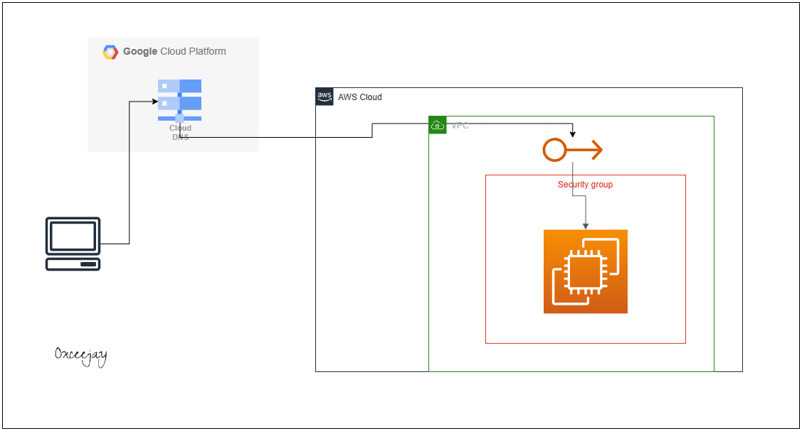
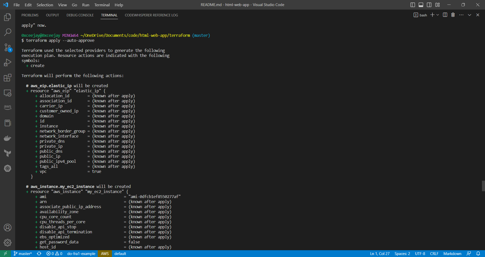
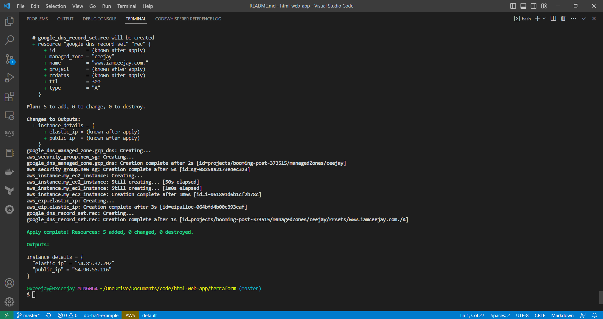
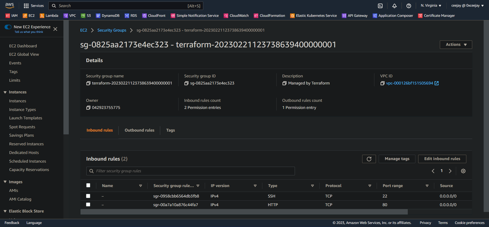
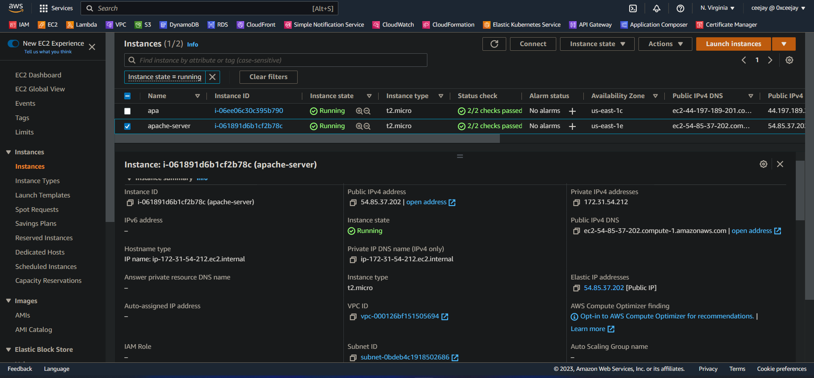
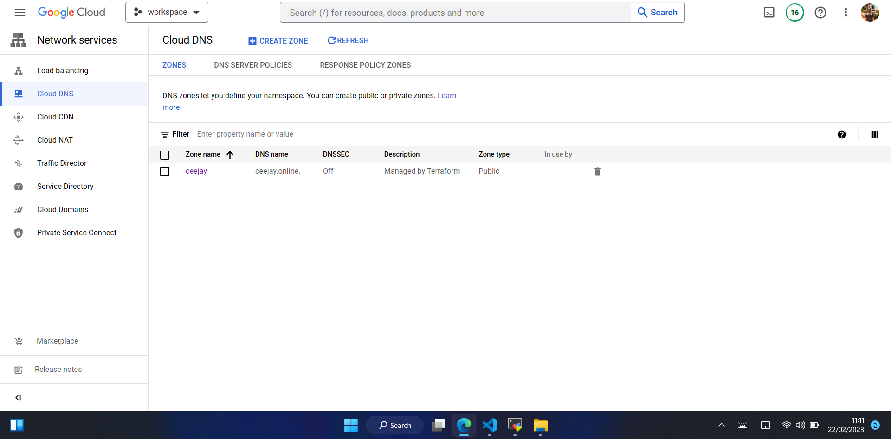
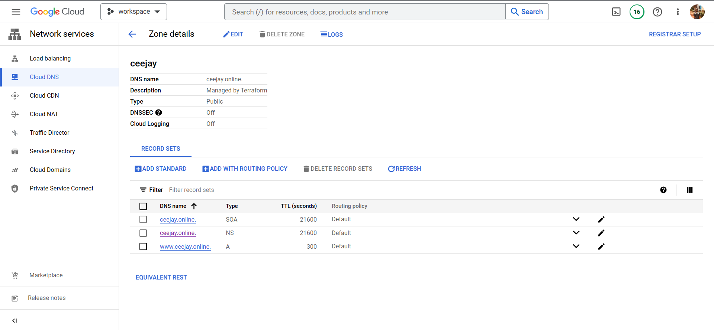

# Html-Web-App: Host a simple HTML based web application using Apache Webserver on Linux Instance

[*Project Source*](https://devopsrealtime.com/setup-apache-webserver-on-aws-ec2-instance/)


## Prerequisites
  * You must be having an AWS account to create infrastructure resources on AWS cloud.
  * You must be having an GCP account to create infrastructure resources on GCP cloud.
  * Terraform


## Project instructions:
### Step 1
- In this step we will terraform to provision infrastructure
- First we will change directory into the terraform directory 
  ```
  cd terraform 
  ```
- Next we initialize the terraform configuration
  ```
  terraform init
  ```

- Create a terraform.tfvars file with the following configuration
  ```sh 
  # key pair on AWS
  ssh_key = ""
  # workstation ip
  my-ip = ""
  # Project id for google cloud project chosen
  project-id = ""
  ```
- To preview changes run
  ```sh 
  terraform plan
  ```

  - To execute the plan run 
  ```sh 
  terraform apply --auto-approve
  ```
-  Next we check our provisioned infrastructure

    
    
    
    
    
    

### Step 2
Now, we need to run the below set of commands one by one, to install the apache webserver and git on our instance.
- First we ssh into our ec2 instance as ec2-user
  ```
  ssh -i {/path/my-key-pair} ec2-user@{elastic-ip}
  ```
- Update the latest package available
  ```
  sudo yum update -y
  ```
- Install Apache Web Server
  ```
  sudo yum install -y httpd.x86_64
  ```
- Install git
  ```
  sudo yum install -y git
  ```
- Start Apache Server
  ```
  sudo systemctl start httpd.service
  ```
- Configure Apache to run on system boot
  ```
  sudo systemctl enable httpd.service
  ```
- Clone repository
  ```
  git clone https://github.com/0xceejay/html-web-app.git
  ```
- Copy files to apache server
  ```
  sudo cp -R html-web-app/ /var/www/html/app
  ```
- Verify the installation on
  ```
  http://{elastic-ip}/app/
  ```
  
  
### Step 3
